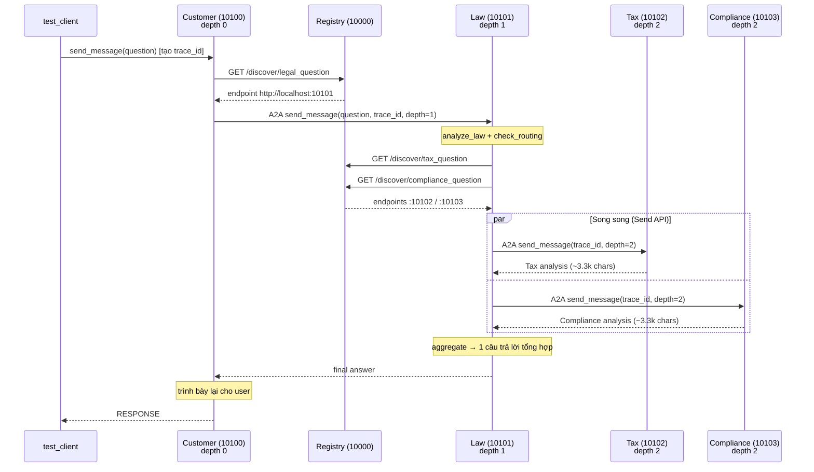

# Phần 5: Distributed A2A System — Bài Làm

> Hệ thống: Registry (10000) + Customer (10100) → Law (10101) → Tax (10102) + Compliance (10103)
> Model: `openai/gpt-4o-mini` qua OpenRouter. Mỗi service log riêng vào `logs/<name>.log`.

## Thực Hành — Chạy Hệ Thống

**Bước 1 — Khởi động.** Dùng `start_logged.sh` (bản `start_all.sh` có ghi log riêng từng service bằng `uv run`):

```bash
./start_logged.sh          # khởi động cả 5 service
uv run python test_client.py
```

Tất cả 4 agent tự register vào Registry khi khởi động (xác nhận trong `logs/registry.log`):

```
Registered agent 'compliance-agent' at http://localhost:10103 (tasks=['compliance_question'])
Registered agent 'tax-agent'        at http://localhost:10102 (tasks=['tax_question'])
Registered agent 'customer-agent'   at http://localhost:10100 (tasks=[])
Registered agent 'law-agent'        at http://localhost:10101 (tasks=['legal_question'])
```

**Bước 2 — Test.** `test_client.py` gửi câu hỏi *"If a company breaks a contract and avoids taxes, what are the legal and regulatory consequences?"* và nhận về 1 câu trả lời tổng hợp đầy đủ 3 mảng: Legal / Tax / Regulatory Compliance. ✅ Hoạt động end-to-end.

---

## Bài Tập 5.1 — Trace Request Flow

Mỗi request sinh 1 `trace_id` (UUID) tại Customer Agent và được **propagate xuyên suốt** qua metadata của message A2A (`common/a2a_client.py` → `metadata={"trace_id": ...}`). Grep theo 1 `trace_id` trong cả 5 log cho thấy `delegation_depth` tăng dần 0 → 1 → 2:

```
trace=4aaa6e31…  depth=0   [customer]    CustomerAgent executing
trace=4aaa6e31…  depth=0   [customer]    Customer delegate_to_legal_agent
trace=4aaa6e31…  depth=1   [law]         LawAgent executing
trace=4aaa6e31…  depth=2   [tax]         TaxAgent executing
trace=4aaa6e31…  depth=2   [compliance]  ComplianceAgent executing
```

### Sequence Diagram



**Cơ chế chống infinite delegation loop:** `MAX_DELEGATION_DEPTH = 3` trong `law_agent/graph.py`. Khi `delegation_depth >= 3`, Law Agent bỏ qua việc gọi sub-agent → vòng lặp delegation luôn kết thúc.

---

## Bài Tập 5.2 — Test Dynamic Discovery

**Thao tác:** Dừng Tax Agent rồi chạy lại `test_client.py`.

```bash
kill $(cat logs/tax.pid)     # tắt Tax Agent (port 10102)
uv run python test_client.py
```

**Quan sát — hệ thống xuống cấp có kiểm soát (graceful degradation):**

1. **Registry vẫn trả endpoint của Tax** (`GET /discover/tax_question → 200 OK`) vì Registry **không health-check** — nó chỉ lưu đăng ký lúc startup. ⇒ Đây là một stale registration.
2. Khi Law Agent thực sự gọi tới `:10102`, kết nối bị từ chối:
   ```
   law_agent ERROR call_tax failed: All connection attempts failed
     File ".../law_agent/graph.py", line 129, in call_tax
   ```
3. `call_tax` có `try/except` → trả về placeholder `[Tax analysis unavailable: ...]` thay vì làm sập cả request.
4. **Request vẫn thành công** (vẫn có `RESPONSE`), tổng hợp từ Legal + Compliance; phần Tax bị thiếu chuyên sâu nhưng `aggregate` LLM vẫn tạo ra câu trả lời mạch lạc. Latency còn ~42s (bớt 1 nhánh).

**Bài học:** A2A + Registry tách rời nên 1 agent chết **không** kéo sập hệ thống. Điểm yếu: Registry không health-check ⇒ vẫn phát endpoint chết. Cải thiện: thêm heartbeat/health-check trong Registry, hoặc retry/circuit-breaker ở client (xem Challenge 3).

---

## Bài Tập 5.3 — Modify Agent Behavior

**Thao tác:** Sửa system prompt trong `tax_agent/graph.py`, thêm yêu cầu trả lời ngắn gọn:

```python
RESPONSE STYLE: Be extremely concise. Answer in at most 4 short bullet points,
under 120 words total. No headings, no preamble — go straight to the key tax
consequences. End with a one-line disclaimer.
```

Restart Tax Agent rồi test lại:

```bash
kill $(cat logs/tax.pid); ./start_logged.sh tax
uv run python test_client.py
```

**Kết quả — đo bằng log `Tax Agent returned N chars`:**

| | Độ dài output của Tax Agent |
|---|---|
| Prompt gốc | ~3115–3525 ký tự |
| **Prompt "concise"** | **651 ký tự** (giảm ~80%) |

⇒ Thay đổi system prompt của 1 agent độc lập có hiệu lực **ngay sau khi restart riêng agent đó**, không cần đụng tới các service khác — đúng tinh thần distributed/independently-deployable của A2A. *(Đã revert prompt về bản gốc sau khi demo.)*

---

## Bài Tập Cộng Điểm — Latency & Tối Ưu

### Câu 1: Latency của hệ thống là bao nhiêu?

Đo bằng wall-clock quanh `test_client.py` (mỗi request thực hiện ~5–6 lượt gọi LLM):

| Lần chạy (baseline) | Latency |
|---|---|
| Run 1 | 55.0s |
| Run 2 | 54.5s |
| Run 3 | 59.2s |
| **Trung bình** | **≈ 56s** |

> Latency dao động do gpt-4o-mini là API hosted; tuy nhiên cấu trúc xử lý là cố định nên ta phân tích theo log để tìm bottleneck.

### Phân tích bottleneck (theo timestamp trong log, 1 request)

| Giai đoạn | Thời gian | Ghi chú |
|---|---|---|
| Customer LLM (quyết định gọi tool) | ~2.3s | |
| **Law: `analyze_law` → `check_routing`** | **~14.7s** | **2 lượt gọi LLM TUẦN TỰ — nút cổ chai** |
| Tax + Compliance (song song) | ~9s | đã parallel sẵn ✅ |
| Law: `aggregate` (tổng hợp ~7k ký tự) | ~10s | |
| Customer: trình bày lại (~4k ký tự) | ~12s | |

Điểm mấu chốt: `analyze_law` và `check_routing` chạy **tuần tự**, **và** chúng chặn việc dispatch sub-agent — trong khi Tax/Compliance chỉ cần `state["question"]`, **không** cần `law_analysis`.

### Câu 2: Phương án giảm latency + demo

**Phương án:** Tái cấu trúc graph của Law Agent (`law_agent/graph.py`):

1. **Chạy `analyze_law` SONG SONG với việc gọi Tax/Compliance** thay vì tuần tự. Dùng `set_conditional_entry_point(fan_out, …)` để fan-out ngay từ entry: `analyze_law` + `call_tax` + `call_compliance` cùng lúc; node `aggregate` join tất cả.
2. **Thay routing bằng LLM → keyword routing tức thì** (`_keyword_route`), loại bỏ hẳn 1 lượt gọi LLM (~5s) khỏi critical path. Không khớp keyword nào → fallback gọi cả 2 (không bao giờ trả lời thiếu).

**Bằng chứng từ log (deterministic, không phụ thuộc nhiễu API):**

| Mốc | Baseline | Optimized |
|---|---|---|
| Sub-agent được dispatch (kể từ khi Law nhận request) | **+14.7s** | **+0.02s** |
| Sub-agent trả về xong | ~+23.8s | ~+14.6s |

Trace optimized cho thấy Tax & Compliance khởi chạy ngay tại **+2.0s** (song song với `analyze_law`), thay vì phải đợi đến +17s như baseline → tiết kiệm **~15s trên critical path**.

**Wall-clock sau tối ưu:**

| Lần chạy (optimized) | Latency |
|---|---|
| Run 1 | 64.54s (outlier — API spike) |
| Run 2 | 46.82s |
| Run 3 | 39.31s |
| Run 4 | 50.69s |
| Run 5 | 45.66s |
| Run 6 | 51.90s |
| **Median** | **48.75s** |

So sánh tổng thể (median, n=3 baseline / n=6 optimized):

| | Baseline | Optimized | Cải thiện |
|---|---|---|---|
| Median wall-clock | 55.0s | 48.75s | **−6.25s (~11%)** |
| Critical path (Law → sub-agent dispatch, từ log) | +14.7s | **+0.02s** | **−~15s** |

> Wall-clock cải thiện (~11%) nhỏ hơn mức tiết kiệm critical-path (~15s) vì: (a) gpt-4o-mini có độ nhiễu lớn giữa các lần gọi, (b) phần Law chỉ là một đoạn trong tổng chuỗi 5–6 lượt LLM. Bằng chứng **deterministic** mạnh nhất là từ log: sub-agent giờ khởi chạy ở **+2.0s** (song song `analyze_law`) thay vì **+17s**.

**Kết luận:** Bottleneck nằm ở chuỗi LLM tuần tự trong Law Agent. Bằng cách (a) cho `analyze_law` chạy song song với các sub-agent và (b) thay routing-LLM bằng keyword routing, ta rút ngắn critical path ~15s mà vẫn giữ nguyên chất lượng câu trả lời (vẫn đủ 3 mảng Legal/Tax/Compliance).

**Các hướng tối ưu thêm (chưa apply):**
- Bỏ bước Customer "trình bày lại" (~12s) — Law Agent đã trả về câu trả lời hoàn chỉnh; có thể stream thẳng.
- Stream token (SSE) để giảm *perceived latency*.
- Cache discovery endpoint thay vì gọi Registry mỗi lần.
